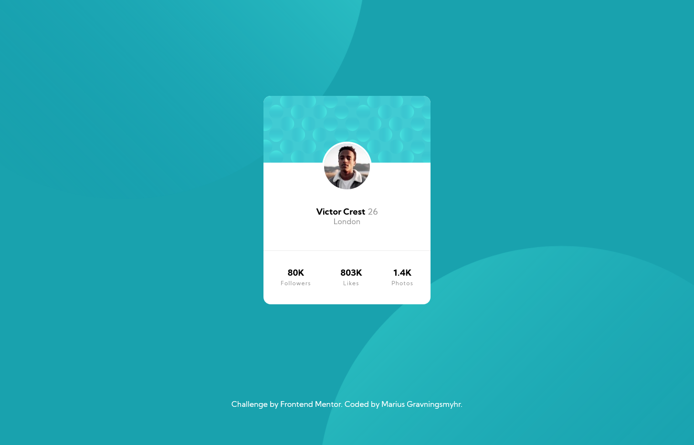

# Frontend Mentor - Profile card component solution

This is a solution to the [Profile card component challenge on Frontend Mentor](https://www.frontendmentor.io/challenges/profile-card-component-cfArpWshJ). Frontend Mentor challenges help you improve your coding skills by building realistic projects.

## Table of contents

- [Overview](#overview)
  - [The challenge](#the-challenge)
  - [Screenshot](#screenshot)
  - [Links](#links)
- [My process](#my-process)
  - [Built with](#built-with)
  - [What I learned](#what-i-learned)
  - [Continued development](#continued-development)
  - [Useful resources](#useful-resources)
- [Author](#author)

## Overview

### The challenge

- Build out the project to the designs provided

### Screenshot

### Links

- Live Site URL: [https://peaceful-poincare-247bd9.netlify.app/](https://peaceful-poincare-247bd9.netlify.app/)
- Solution URLL: [https://github.com/mariusgrHiof/profile-card-component-main](https://github.com/mariusgrHiof/profile-card-component-main)

## My process

### Built with

- Semantic HTML5 markup
- CSS
- CSS custom properties
- Flexbox

**Note: These are just examples. Delete this note and replace the list above with your own choices**

### What I learned

I've learned how to utilize flexbox to layout my page and make it responsive on tablet and mobile devices.

If you want more help with writing markdown, we'd recommend checking out [The Markdown Guide](https://www.markdownguide.org/) to learn more.

### Continued development

I'm going to enhance my HTML and CSS skills by continue creating more sites and add javaScript to make the sites interactive.

### Useful resources

- [Responsive design made easy by Kevin Powell](https://www.youtube.com/watch?v=bn-DQCifeQQ) - This helped me when I was creating the tablet and mobile version.

## Author

- Frontend Mentor - [@mariusgrHiof](https://www.frontendmentor.io/profile/mariusgrHiof)
- Twitter - [@Marius22261747](https://www.twitter.com/Marius22261747)
